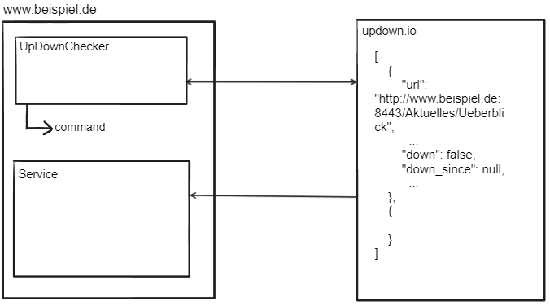
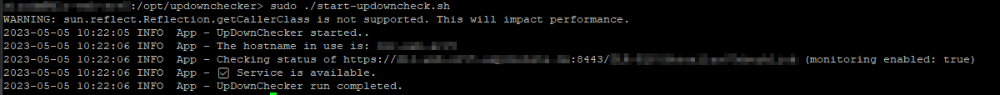

Need an english documentation? Please scroll down.

# UpDownChecker

Der UpDownChecker ist ein Java-Tool, das die API von updown.io nutzt und prüft, ob ein bestimmter Service länger als eine definierte Zeitspanne nicht erreichbar ist. Ist dies der Fall, dann wird ein konfigurierbarer Befehl ausgeführt. Voraussetzung zur Verwendung des UpDownChecker ist Java 11 oder neuer.

Dienste auf einem Server sind manchmal nicht mehr responsiv, werden aber z.B. via systemctl trotzdem mit Status 'running' angezeigt. Dienste wie updown.io prüfen von außen per Webaufruf, ob ein Dienst noch responsiv ist und geben Alarm, wenn das nicht der Fall ist. Zusätzlich zur GUI unter updown.io bietet updown.io eine API an, die einen Status über alle überwachten Dienste liefert. Der UpDownChecker nutzt diese API und führt bei nicht-Erreichbarkeit eines Service einen Befehl auf der Konsole aus. Dieser kann z.B. den nicht mehr erreichbaren Service neu starten.
Der Aufruf von UpDownChecker kann z.B. regelmäßig per crontab erfolgen.

# Verwendung

Der UpDownChecker lässt sich wie folgt starten:

java -jar updowncheck-1.0-SNAPSHOT.jar

| Argument | Wert / Beispiel | Optional |
| --- | --- | --- |
| token | das Read-Only Token von updown.io, kann hier entnommen werden: https://updown.io/api<br>Beispiel: token=ro-LNpouNLqUEJ9reg6j123 (das Token ist ungültig und dient nur als Beispiel) |     |
| watchservice | die URL des updown.io Rest-Service.<br>Beispiel: watchservice=https://updown.io/api/checks |     |
| command | der Befehl, der ausgeführt werden soll, wenn der überwachte Dienst, auf den upopows zutrifft, down ist. Muss mit Anführungszeichen umgeben sein, wenn er aus mehreren Werten besteht.<br>Beispiel: command="systemctl restart tomcat.service" |     |
| hostname | Der Hostname des aktuellen Servers, auf dem UpDownChecker läuft. Muss in dem url-Wert des zu überwachenden Dienstes vorkommen.<br>Default: Rückgabewert von `InetAddress.getLocalHost()`<br> Beispiel: hostname=www.beispiel.de | optional |
| upopows | = url-path or port of watched service - dient dazu anhand eines Merkmals den zu überwachenden Dienst zu bestimmen.<br>Beispiel: upopows=8443 |     |
| minutes | Anzahl Minuten, die ein Dienst maximal down sein darf, bevor command ausgeführt wird. Default: 90<br>minutes=60 | optional |

# Beispiel mit Erläuterungen

Aufruf: `java -jar updowncheck-1.0-SNAPSHOT.jar token=ro-LNpouNLqUEJ9reg6j123 watchservice=https://updown.io/api/checks command="systemctl restart tomcat.service" upopows=8443`

Der UpDownChecker ruft zunächst die **Watchservice**-URL auf und sendet das **Token** im Header mit. Da der Aufruf per https erfolgt, wird das Token verschlüsselt übertragen. Der Aufruf liefert dann ein JSON mit Status-Objekten zurück - ein Objekt pro überwachtem Service. Als nächstes prüft der UpDownChecker bei jedem Status-Objekt, ob der **Hostname** in dem Wert von Url vorkommt und ob **upopws** in dem Wert von Url ebenfalls vorkommt. Wenn Hostname und upopws im url-Wert vorkommen, dann wird als nächstes geprüft ob der Service down ist und ob der Wert down_since weiter als Anzahl **Minutes** in der Vergangenheit liegt. Ist das der Fall, dann wird der Wert von **command** auf der Konsole als Befehl ausgeführt und der UpDownChecker beendet.



# Automatische Ausführung

Im folgenden Beispiel wird davon ausgegangen, dass die jar-Datei im Verzeichnis /opt/updownchecker liegt.
Der UpDownChecker kann automatisch via Crontask ausgeführt werden. Hierzu ist zunächst eine neue Datei `start-updowncheck.sh` mit folgenden Inhalt anzulegen:
```
java -jar /opt/updownchecker/updowncheck-1.0-SNAPSHOT.jar token=<TOKEN> watchservice=https://updown.io/api/checks command="systemctl restart tomcat.service" upopows=8443
```

Die zugehörige CronTask Definition sieht dann wie folgt aus:
```
 sudo crontab -e
 0 0-23/2 * * * /opt/updownchecker/start-updowncheck.sh
```
Der Task wird alle 2 Stunden jeweils zur vollen Stunde ausgeführt. 

Das Script `start-updowncheck.sh` kann natürlich auch direkt ausgeführt werden:



# Logs

Logs werden in das Verzeichnis `/opt/updownchecker/logs` geschrieben. Der Pfad kann in der log4j2.xml entsprechend angepasst werden:
```xml
<Configuration status="WARN" monitorInterval="30">
    <Properties>
        <Property name="LOG_PATTERN">%d{yyyy-MM-dd HH:mm:ss} %-5p %c{1} - %m%n</Property>
        <Property name="path">/opt/updownchecker/logs</Property>
    </Properties>
    ...
```


# Test

Vor dem Aufruf eines Tests muss unter `src/test/resources` eine Datei `config.properties` angelegt werden mit folgendem Inhalt:
```
// Do not put this file under git control
token=<YOUR TOKEN>
```
Ihr Token finden Sie nach dem Login hier: https://updown.io/api

Test ausführen: 
- Windows: `./gradlew.bat test`
- Linux / MacOS: `./gradlew test`

----

# English translation


# UpDownChecker

The UpDownChecker is a Java tool that uses the API of updown.io and checks if a certain service is down for longer than a defined period of time. If this is the case, then a configurable command is executed. A prerequisite for using the UpDownChecker is Java 11 or newer.

Services on a server are sometimes no longer responsive, but are still displayed with the status 'running' via systemctl. Services like updown.io check from the outside via web call if a service is still responsive and give alarm if this is not the case. In addition to the GUI under updown.io, updown.io offers an API that provides a status about all monitored services. The UpDownChecker uses this API and executes a command on the console if a service is not available. This can, for example, restart the unreachable service.
The call of UpDownChecker can be done e.g. regularly via crontab.

# Usage

The UpDownChecker can be started as follows:

java -jar updowncheck-1.0-SNAPSHOT.jar

| Argument | Value / example | optional |
| --- | --- | --- |
| token | the read-only token of updown.io, can be taken here: https://updown.io/api<br>Example: token=ro-LNpOuNLqUEJ7reg6j123 (the token is invalid and serves only as an example) |     |
| watchservice | the URL of the updown.io rest service.<br>Example: watchservice=https://updown.io/api/checks |     |
| command | the command to execute when the monitored service to which upopows applies is down. Must be surrounded by quotes if it consists of multiple values. <br>Example: command="systemctl restart tomcat.service" |     |
| hostname | The hostname of the current server on which UpDownChecker is running. Must appear in the url value of the service to be monitored.<br>Default: value of `InetAddress.getLocalHost()`<br>Example: hostname=www.example.com | optional |
| upopows | = url-path or port of watched service - is used to determine the service to be monitored on the basis of a feature.<br>Example: upopows=8443 |     |
| minutes | Maximum number of minutes a service may be down before command is executed. Default: 90<br>minutes=60 | optional |

# Example with explanations

Usage: `java -jar updowncheck-1.0-SNAPSHOT.jar token=ro-LNpouNLqUEJ9reg6j123 watchservice=https://updown.io/api/checks command="systemctl restart tomcat.service" upopows=8443`

The UpDownChecker first calls the **watchservice** URL and sends the **token** along in the header. Since the call is made via https, the token is transmitted encrypted. The call then returns a JSON with status objects - one object per monitored service. Next, for each status object, UpDownChecker checks if the **hostname** occurs in the value of url and if **upopws** also occurs in the value of url. If hostname and upopws occur in the url value, then the next check is whether the service is down and whether the value down_since is further than number of **minutes** in the past. If it is, then the value of **command** is executed on the console as a command and the UpDownChecker terminates.


# Sceduled execution
The following example assumes that the jar file is located in the /opt/updownchecker directory.
The UpDownChecker can be executed automatically via Crontask. For this purpose, a new file `start-updowncheck.sh` must first be created with the following content:

```
java -jar /opt/updownchecker/updowncheck-1.0-SNAPSHOT.jar token=<TOKEN> watchservice=https://updown.io/api/checks command="systemctl restart tomcat.service" upopows=8443
```
The corresponding CronTask definition then looks like this:
```
 sudo crontab -e
 0 0-23/2 * * * /opt/updownchecker/start-updowncheck.sh
```

The task is executed every 2 hours on the hour. 

The script `start-updowncheck.sh` can of course also be executed directly:


# Logs

Logs are written to the directory /opt/updownchecker/logs. The path can be adjusted accordingly in log4j2.xml:
```xml
<Configuration status="WARN" monitorInterval="30">
    <Properties>
        <Property name="LOG_PATTERN">%d{yyyy-MM-dd HH:mm:ss} %-5p %c{1} - %m%n</Property>
        <Property name="path">/opt/updownchecker/logs</Property>
    </Properties>
    ...
```

# Test

Before starting a test, a file `config.properties` must be created under `src/test/resources` with the following content:
```
// Do not put this file under git control
token=<YOUR TOKEN>
```
You will find your token after login here: https://updown.io/api

Execute test:

- Windows: `./gradlew.bat test`
- Linux / MacOS: `./gradlew test`